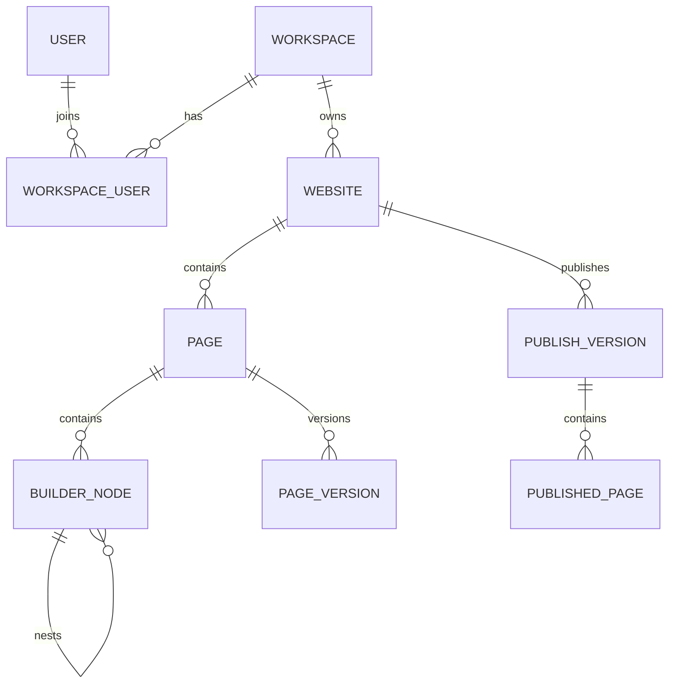

# Entity relationship diagram

```mermaid
erDiagram
    USER ||--o{ WORKSPACE_USER : joins
    WORKSPACE ||--o{ WORKSPACE_USER : has
    WORKSPACE ||--o{ WEBSITE : owns
    WEBSITE ||--o{ PAGE : contains
    PAGE ||--o{ BUILDER_NODE : contains
    BUILDER_NODE ||--o{ BUILDER_NODE : nests
    PAGE ||--o{ PAGE_VERSION : versions
    WEBSITE ||--o{ PUBLISH_VERSION : publishes
    PUBLISH_VERSION ||--o{ PUBLISHED_PAGE : contains
```
